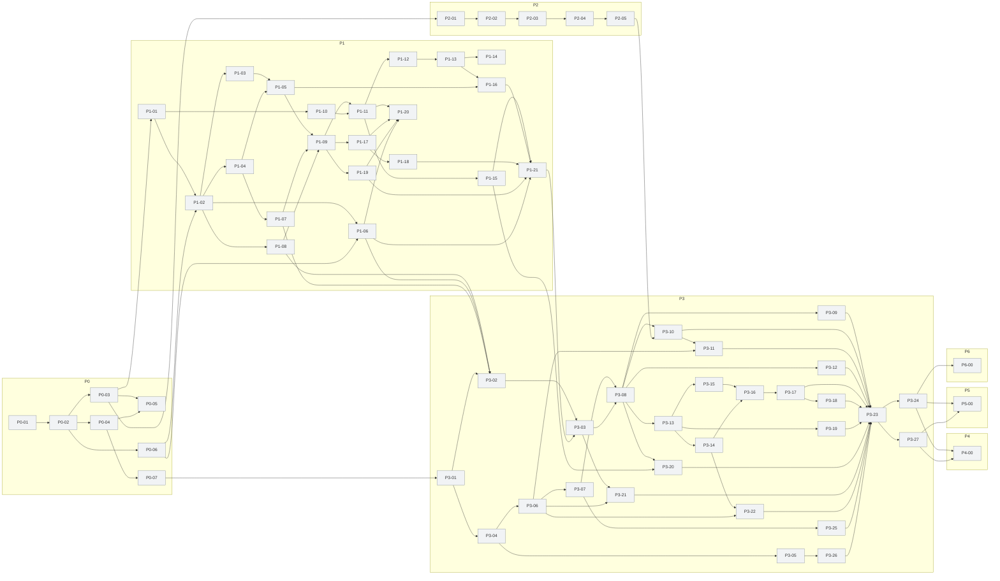

# 任务依赖图

> 本文件由 `python tools/plan_lint.py` 在本地生成，不纳入 Git。箭头表示“先完成 → 后开工”。

```mermaid
flowchart LR
    classDef done fill:#d3f9d8,stroke:#2b8a3e
    classDef in_progress fill:#fff3bf,stroke:#e67700
    classDef blocked fill:#ffe3e3,stroke:#c92a2a
    classDef todo fill:#f1f3f5,stroke:#868e96
    subgraph P0
        P0_01["P0-01"]:::todo
        P0_02["P0-02"]:::todo
        P0_03["P0-03"]:::todo
        P0_04["P0-04"]:::todo
        P0_05["P0-05"]:::todo
        P0_06["P0-06"]:::todo
        P0_07["P0-07"]:::todo
    end
    subgraph P1
        P1_01["P1-01"]:::todo
        P1_02["P1-02"]:::todo
        P1_03["P1-03"]:::todo
        P1_04["P1-04"]:::todo
        P1_05["P1-05"]:::todo
        P1_06["P1-06"]:::todo
        P1_07["P1-07"]:::todo
        P1_08["P1-08"]:::todo
        P1_09["P1-09"]:::todo
        P1_10["P1-10"]:::todo
        P1_11["P1-11"]:::todo
        P1_12["P1-12"]:::todo
        P1_13["P1-13"]:::todo
        P1_14["P1-14"]:::todo
        P1_15["P1-15"]:::todo
        P1_16["P1-16"]:::todo
        P1_17["P1-17"]:::todo
        P1_18["P1-18"]:::todo
        P1_19["P1-19"]:::todo
        P1_20["P1-20"]:::todo
        P1_21["P1-21"]:::todo
    end
    subgraph P2
        P2_01["P2-01"]:::todo
        P2_02["P2-02"]:::todo
        P2_03["P2-03"]:::todo
        P2_04["P2-04"]:::todo
        P2_05["P2-05"]:::todo
    end
    subgraph P3
        P3_01["P3-01"]:::todo
        P3_02["P3-02"]:::todo
        P3_03["P3-03"]:::todo
        P3_04["P3-04"]:::todo
        P3_05["P3-05"]:::todo
        P3_06["P3-06"]:::todo
        P3_07["P3-07"]:::todo
        P3_08["P3-08"]:::todo
        P3_09["P3-09"]:::todo
        P3_10["P3-10"]:::todo
        P3_11["P3-11"]:::todo
        P3_12["P3-12"]:::todo
        P3_13["P3-13"]:::todo
        P3_14["P3-14"]:::todo
        P3_15["P3-15"]:::todo
        P3_16["P3-16"]:::todo
        P3_17["P3-17"]:::todo
        P3_18["P3-18"]:::todo
        P3_19["P3-19"]:::todo
        P3_20["P3-20"]:::todo
        P3_21["P3-21"]:::todo
        P3_22["P3-22"]:::todo
        P3_23["P3-23"]:::todo
        P3_24["P3-24"]:::todo
        P3_25["P3-25"]:::todo
        P3_26["P3-26"]:::todo
        P3_27["P3-27"]:::todo
    end
    subgraph P4
        P4_00["P4-00"]:::todo
    end
    subgraph P5
        P5_00["P5-00"]:::todo
    end
    subgraph P6
        P6_00["P6-00"]:::todo
    end
    P0_01 --> P0_02
    P0_02 --> P0_03
    P0_02 --> P0_04
    P0_03 --> P0_05
    P0_04 --> P0_05
    P0_02 --> P0_06
    P0_04 --> P0_07
    P0_03 --> P1_01
    P1_01 --> P1_02
    P0_06 --> P1_02
    P1_02 --> P1_03
    P1_02 --> P1_04
    P1_03 --> P1_05
    P1_04 --> P1_05
    P1_02 --> P1_06
    P0_06 --> P1_06
    P1_04 --> P1_07
    P1_02 --> P1_08
    P1_05 --> P1_09
    P1_07 --> P1_09
    P1_08 --> P1_09
    P1_01 --> P1_10
    P1_09 --> P1_11
    P1_10 --> P1_11
    P1_11 --> P1_12
    P1_12 --> P1_13
    P1_13 --> P1_14
    P1_11 --> P1_15
    P1_13 --> P1_16
    P1_05 --> P1_16
    P1_09 --> P1_17
    P1_17 --> P1_18
    P1_09 --> P1_19
    P1_11 --> P1_20
    P1_17 --> P1_20
    P1_19 --> P1_20
    P1_06 --> P1_20
    P1_15 --> P1_21
    P1_16 --> P1_21
    P1_18 --> P1_21
    P1_19 --> P1_21
    P1_06 --> P1_21
    P0_03 --> P2_01
    P2_01 --> P2_02
    P2_02 --> P2_03
    P2_03 --> P2_04
    P2_04 --> P2_05
    P0_07 --> P3_01
    P3_01 --> P3_02
    P1_08 --> P3_02
    P1_06 --> P3_02
    P1_07 --> P3_02
    P3_02 --> P3_03
    P1_21 --> P3_03
    P3_01 --> P3_04
    P3_04 --> P3_05
    P3_04 --> P3_06
    P3_06 --> P3_07
    P3_07 --> P3_08
    P3_03 --> P3_08
    P3_08 --> P3_09
    P3_08 --> P3_10
    P2_05 --> P3_10
    P3_10 --> P3_11
    P3_06 --> P3_11
    P3_08 --> P3_12
    P3_08 --> P3_13
    P3_13 --> P3_14
    P3_13 --> P3_15
    P3_15 --> P3_16
    P3_14 --> P3_16
    P3_16 --> P3_17
    P3_17 --> P3_18
    P3_13 --> P3_19
    P3_08 --> P3_20
    P1_15 --> P3_20
    P3_03 --> P3_21
    P3_06 --> P3_21
    P3_14 --> P3_22
    P3_06 --> P3_22
    P3_09 --> P3_23
    P3_10 --> P3_23
    P3_11 --> P3_23
    P3_12 --> P3_23
    P3_17 --> P3_23
    P3_18 --> P3_23
    P3_19 --> P3_23
    P3_20 --> P3_23
    P3_21 --> P3_23
    P3_22 --> P3_23
    P3_25 --> P3_23
    P3_26 --> P3_23
    P3_23 --> P3_24
    P3_07 --> P3_25
    P3_05 --> P3_26
    P3_23 --> P3_27
    P3_24 --> P4_00
    P3_27 --> P4_00
    P3_24 --> P5_00
    P3_27 --> P5_00
    P3_24 --> P6_00
```
