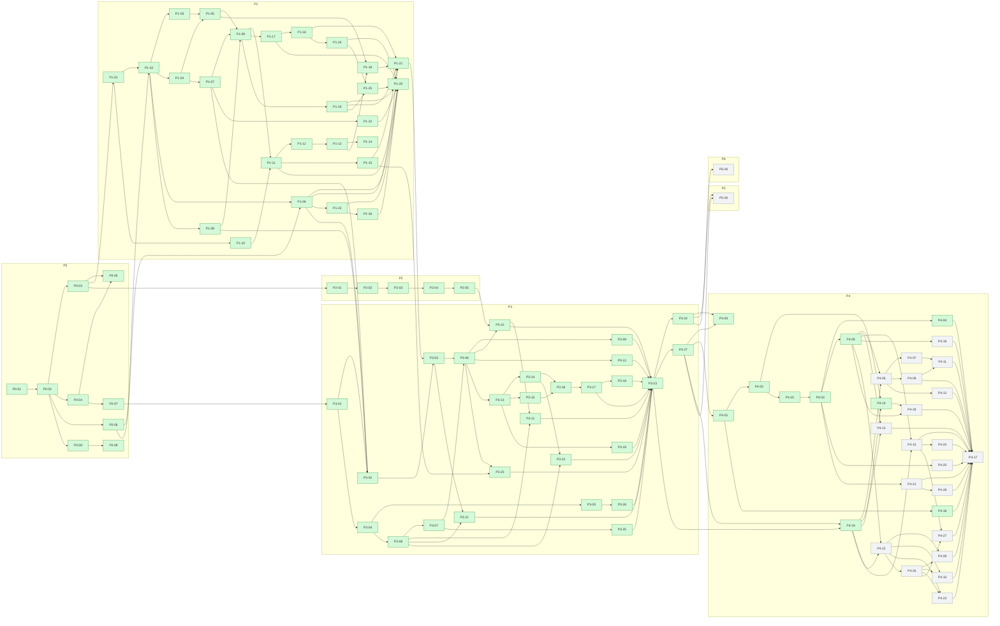

# 任务依赖图

> 本文件由 `python tools/plan_lint.py` 生成并纳入 Git，请勿手工编辑。箭头表示“先完成 → 后开工”。

```mermaid
flowchart LR
    classDef done fill:#d3f9d8,stroke:#2b8a3e
    classDef in_progress fill:#fff3bf,stroke:#e67700
    classDef blocked fill:#ffe3e3,stroke:#c92a2a
    classDef todo fill:#f1f3f5,stroke:#868e96
    subgraph P0
        P0_01["P0-01"]:::done
        P0_02["P0-02"]:::done
        P0_03["P0-03"]:::done
        P0_04["P0-04"]:::done
        P0_05["P0-05"]:::done
        P0_06["P0-06"]:::done
        P0_07["P0-07"]:::done
        P0_08["P0-08"]:::done
        P0_09["P0-09"]:::done
    end
    subgraph P1
        P1_01["P1-01"]:::done
        P1_02["P1-02"]:::done
        P1_03["P1-03"]:::done
        P1_04["P1-04"]:::done
        P1_05["P1-05"]:::done
        P1_06["P1-06"]:::done
        P1_07["P1-07"]:::done
        P1_08["P1-08"]:::done
        P1_09["P1-09"]:::done
        P1_10["P1-10"]:::done
        P1_11["P1-11"]:::done
        P1_12["P1-12"]:::done
        P1_13["P1-13"]:::done
        P1_14["P1-14"]:::done
        P1_15["P1-15"]:::done
        P1_16["P1-16"]:::done
        P1_17["P1-17"]:::done
        P1_18["P1-18"]:::done
        P1_19["P1-19"]:::done
        P1_20["P1-20"]:::done
        P1_21["P1-21"]:::done
        P1_22["P1-22"]:::done
        P1_23["P1-23"]:::done
        P1_24["P1-24"]:::done
        P1_25["P1-25"]:::done
        P1_26["P1-26"]:::done
    end
    subgraph P2
        P2_01["P2-01"]:::done
        P2_02["P2-02"]:::done
        P2_03["P2-03"]:::done
        P2_04["P2-04"]:::done
        P2_05["P2-05"]:::done
    end
    subgraph P3
        P3_01["P3-01"]:::done
        P3_02["P3-02"]:::done
        P3_03["P3-03"]:::done
        P3_04["P3-04"]:::done
        P3_05["P3-05"]:::done
        P3_06["P3-06"]:::done
        P3_07["P3-07"]:::done
        P3_08["P3-08"]:::done
        P3_09["P3-09"]:::done
        P3_10["P3-10"]:::done
        P3_11["P3-11"]:::done
        P3_12["P3-12"]:::done
        P3_13["P3-13"]:::done
        P3_14["P3-14"]:::done
        P3_15["P3-15"]:::done
        P3_16["P3-16"]:::done
        P3_17["P3-17"]:::done
        P3_18["P3-18"]:::done
        P3_19["P3-19"]:::done
        P3_20["P3-20"]:::done
        P3_21["P3-21"]:::done
        P3_22["P3-22"]:::done
        P3_23["P3-23"]:::done
        P3_24["P3-24"]:::done
        P3_25["P3-25"]:::done
        P3_26["P3-26"]:::done
        P3_27["P3-27"]:::done
    end
    subgraph P4
        P4_00["P4-00"]:::done
        P4_01["P4-01"]:::done
        P4_02["P4-02"]:::done
        P4_03["P4-03"]:::done
        P4_04["P4-04"]:::done
        P4_05["P4-05"]:::done
        P4_06["P4-06"]:::todo
        P4_07["P4-07"]:::todo
        P4_08["P4-08"]:::todo
        P4_09["P4-09"]:::todo
        P4_10["P4-10"]:::todo
        P4_11["P4-11"]:::todo
        P4_12["P4-12"]:::todo
        P4_13["P4-13"]:::todo
        P4_14["P4-14"]:::done
        P4_15["P4-15"]:::todo
        P4_16["P4-16"]:::done
        P4_17["P4-17"]:::todo
        P4_18["P4-18"]:::done
        P4_19["P4-19"]:::todo
        P4_20["P4-20"]:::todo
        P4_21["P4-21"]:::todo
        P4_22["P4-22"]:::todo
        P4_23["P4-23"]:::todo
        P4_24["P4-24"]:::todo
        P4_25["P4-25"]:::done
        P4_26["P4-26"]:::todo
        P4_27["P4-27"]:::todo
        P4_28["P4-28"]:::todo
        P4_29["P4-29"]:::todo
    end
    subgraph P5
        P5_00["P5-00"]:::todo
    end
    subgraph P6
        P6_00["P6-00"]:::todo
    end
    P0_01 --> P0_02
    P0_02 --> P0_03
    P0_02 --> P0_04
    P0_03 --> P0_05
    P0_04 --> P0_05
    P0_02 --> P0_06
    P0_04 --> P0_07
    P0_02 --> P0_08
    P0_08 --> P0_09
    P0_03 --> P1_01
    P1_01 --> P1_02
    P0_06 --> P1_02
    P1_02 --> P1_03
    P1_02 --> P1_04
    P1_03 --> P1_05
    P1_04 --> P1_05
    P1_02 --> P1_06
    P0_06 --> P1_06
    P1_04 --> P1_07
    P1_02 --> P1_08
    P1_05 --> P1_09
    P1_07 --> P1_09
    P1_08 --> P1_09
    P1_01 --> P1_10
    P1_09 --> P1_11
    P1_10 --> P1_11
    P1_11 --> P1_12
    P1_12 --> P1_13
    P1_13 --> P1_14
    P1_11 --> P1_15
    P1_13 --> P1_16
    P1_05 --> P1_16
    P1_09 --> P1_17
    P1_17 --> P1_18
    P1_09 --> P1_19
    P1_11 --> P1_20
    P1_17 --> P1_20
    P1_19 --> P1_20
    P1_06 --> P1_20
    P1_22 --> P1_20
    P1_23 --> P1_20
    P1_24 --> P1_20
    P1_25 --> P1_20
    P1_26 --> P1_20
    P1_15 --> P1_21
    P1_16 --> P1_21
    P1_18 --> P1_21
    P1_19 --> P1_21
    P1_06 --> P1_21
    P1_07 --> P1_22
    P1_06 --> P1_23
    P1_18 --> P1_24
    P1_19 --> P1_25
    P1_24 --> P1_25
    P1_23 --> P1_26
    P0_03 --> P2_01
    P2_01 --> P2_02
    P2_02 --> P2_03
    P2_03 --> P2_04
    P2_04 --> P2_05
    P0_07 --> P3_01
    P3_01 --> P3_02
    P1_08 --> P3_02
    P1_06 --> P3_02
    P1_07 --> P3_02
    P3_02 --> P3_03
    P1_21 --> P3_03
    P3_01 --> P3_04
    P3_04 --> P3_05
    P3_04 --> P3_06
    P3_06 --> P3_07
    P3_07 --> P3_08
    P3_03 --> P3_08
    P3_08 --> P3_09
    P3_08 --> P3_10
    P2_05 --> P3_10
    P3_10 --> P3_11
    P3_06 --> P3_11
    P3_08 --> P3_12
    P3_08 --> P3_13
    P3_13 --> P3_14
    P3_13 --> P3_15
    P3_15 --> P3_16
    P3_14 --> P3_16
    P3_16 --> P3_17
    P3_17 --> P3_18
    P3_13 --> P3_19
    P3_08 --> P3_20
    P1_15 --> P3_20
    P3_03 --> P3_21
    P3_06 --> P3_21
    P3_14 --> P3_22
    P3_06 --> P3_22
    P3_09 --> P3_23
    P3_10 --> P3_23
    P3_11 --> P3_23
    P3_12 --> P3_23
    P3_17 --> P3_23
    P3_18 --> P3_23
    P3_19 --> P3_23
    P3_20 --> P3_23
    P3_21 --> P3_23
    P3_22 --> P3_23
    P3_25 --> P3_23
    P3_26 --> P3_23
    P3_23 --> P3_24
    P3_07 --> P3_25
    P3_05 --> P3_26
    P3_23 --> P3_27
    P3_24 --> P4_00
    P3_27 --> P4_00
    P3_27 --> P4_01
    P4_01 --> P4_02
    P4_25 --> P4_03
    P4_03 --> P4_04
    P4_03 --> P4_05
    P4_05 --> P4_06
    P4_18 --> P4_06
    P4_06 --> P4_07
    P4_06 --> P4_08
    P4_22 --> P4_09
    P4_26 --> P4_09
    P4_22 --> P4_10
    P4_26 --> P4_10
    P4_07 --> P4_11
    P4_08 --> P4_11
    P4_06 --> P4_12
    P4_05 --> P4_13
    P4_18 --> P4_13
    P4_02 --> P4_14
    P4_18 --> P4_14
    P4_05 --> P4_15
    P4_18 --> P4_15
    P4_01 --> P4_16
    P4_04 --> P4_17
    P4_08 --> P4_17
    P4_09 --> P4_17
    P4_10 --> P4_17
    P4_11 --> P4_17
    P4_12 --> P4_17
    P4_13 --> P4_17
    P4_15 --> P4_17
    P4_16 --> P4_17
    P4_19 --> P4_17
    P4_20 --> P4_17
    P4_21 --> P4_17
    P4_23 --> P4_17
    P4_24 --> P4_17
    P4_27 --> P4_17
    P4_28 --> P4_17
    P4_29 --> P4_17
    P3_23 --> P4_18
    P3_27 --> P4_18
    P4_05 --> P4_19
    P4_03 --> P4_20
    P4_03 --> P4_21
    P4_05 --> P4_22
    P4_18 --> P4_22
    P4_22 --> P4_23
    P4_26 --> P4_23
    P4_15 --> P4_24
    P4_02 --> P4_25
    P4_22 --> P4_26
    P4_15 --> P4_27
    P4_26 --> P4_27
    P4_21 --> P4_28
    P4_05 --> P4_29
    P4_14 --> P4_29
    P3_24 --> P5_00
    P3_27 --> P5_00
    P3_24 --> P6_00
```
